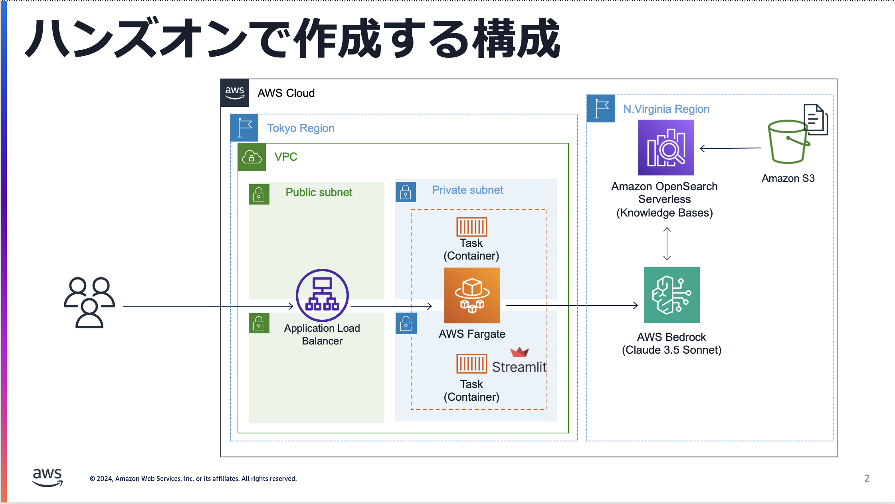
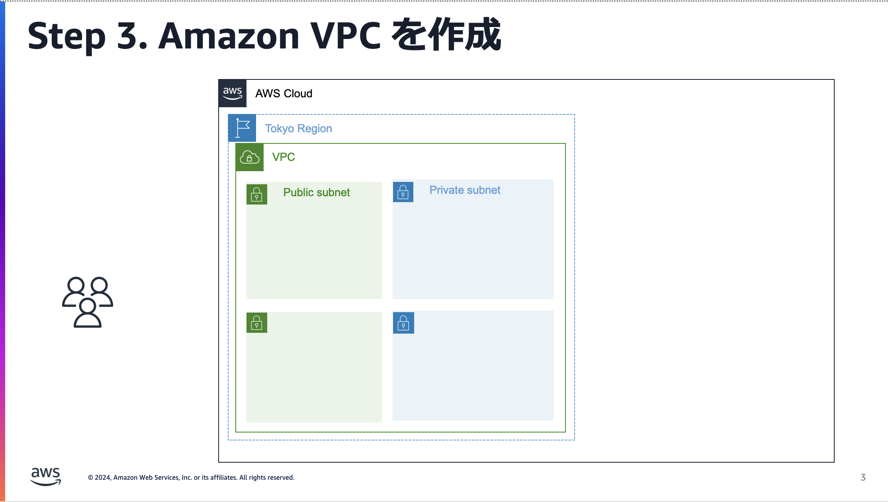
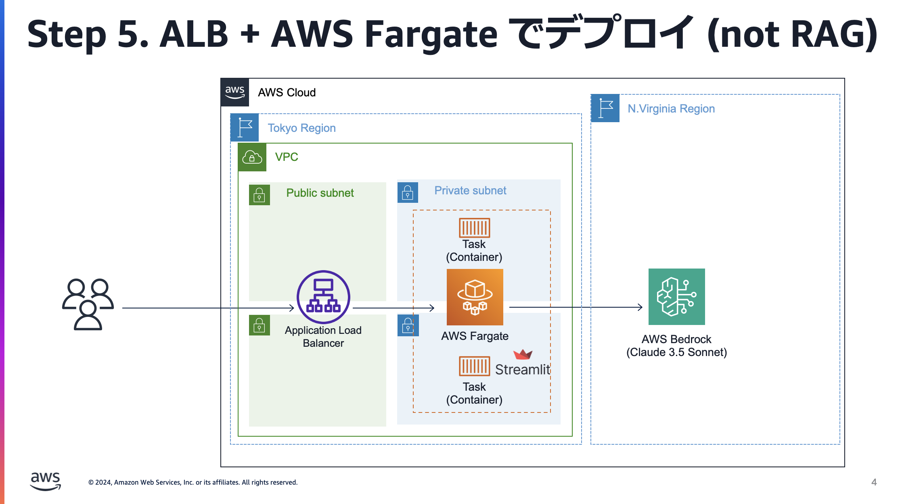
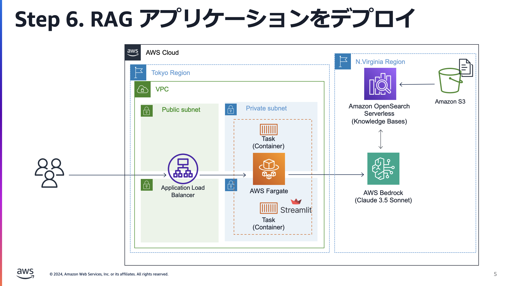

# AWS CDK Hands-on  - Build a RAG Application with Knowledge Bases for Amazon Bedrock 



## 1. 事前準備

操作環境となる AWS Cloud9 環境と、Amazon Bedrock のモデルアクセス設定を行います。

### 1.1. AWS Cloud9 立ち上げ

AWS Cloud9 を簡単に立ち上げられるように AWS SA が提供している[こちらのサンプル](https://github.com/aws-samples/cloud9-setup-for-prototyping/tree/main)を用います。以下の手順に従ってください。

1. 東京リージョンであることを確認の上、[CloudShell](https://console.aws.amazon.com/cloudshell/home) を開いてください。
2. 以下のコマンドでリポジトリをクローンしてください。

```
git clone https://github.com/aws-samples/cloud9-setup-for-prototyping
```
3. ディレクトリに移動してください。

```
cd cloud9-setup-for-prototyping
```
4. 必要に応じてボリューム容量とインスタンスタイプを変更します。「複数行のテキストの安全な貼り付け」というポップアップが表示されたら、「貼り付け」を選択してください。

```
cat <<< $(jq  '.name = "cloud9-for-cdk-workshop"'  params.json )  > params.json
cat <<< $(jq  '.volume_size = 50'  params.json )  > params.json
cat <<< $(jq  '.instance_type = "m5.large"'  params.json )  > params.json
```
5. スクリプトを実行してください。

```
./bin/bootstrap
```
6. [Cloud9](https://console.aws.amazon.com/cloud9/home) に移動し、"Open IDE" をクリックします。

### 1.2. Amazon Bedrock モデルアクセス有効化

今回は**北米リージョン**で Amazon Bedrock を用います。テキストモデルとして **Claude 3.5 Sonnet**、埋め込みモデルとして **Titan Text Embeddings V2** を用います。
※ なお、8 月時点で東京リージョンの Amazon Bedrock でも Knowledge Bases for Amazon Bedrock に Claude 3.5 Sonnet を用いることができるようになりました（[参考記事](https://aws.amazon.com/jp/about-aws/whats-new/2024/08/knowledge-bases-amazon-bedrock-anthropics-claude-3-5-sonnet/)）


1. [Amazon Bedrock (北米リージョン)](https://us-east-1.console.aws.amazon.com/bedrock/home?region=us-east-1#/) にアクセスしてください。[東京リージョン] が選択されている場合は、[北米リージョン] に切り替えることを忘れないでください。
2. 左上のハンバーガーメニュー（“三” マーク）を選択し、**[Bedrock configurations]** から[[モデルアクセス]](https://us-east-1.console.aws.amazon.com/bedrock/home?region=us-east-1#modelaccess) を選択してください。
3. **[Modify Model Access]** を選択し、“Claude 3.5 Sonnet”、“Titan Text Embeddings V2” の 2 箇所にチェックを入れてください。
4. **[Next]** を選択し、Model access modifications に上の2つのモデルの名前が記載されていることを確認し、**[Submit]** を選択してください。


* * *

## 2. AWS CDK 初期設定

### 2.1. AWS CDK アップデート

AWS Cloud9 には AWS CDK を含む様々なランタイムやフレームワークがすでにインストール済みです。
ただ、今回の参加者間で作業の齟齬が生まれないように、AWS CDK のバージョンをハンズオン作成時点の最新版(2.156.0) に統一します。AWS CDKのパッケージ `aws-cdk`と関連モジュールの`aws-cdk-lib`をアップデートします。
 

AWS Cloud9 の画面に戻り、ターミナルにて以下の2つのコマンドを実行してください。

```
npm update -g cdk
pip install —upgrade aws-cdk-lib==2.156.0
```


### 2.2. ディレクトリ構成 & CDK init

今回作成するアプリケーション用のディレクトリを作成します。以下のコマンドを実施してください。

```
cd ~/environment/
mkdir cdk_bedrock_workshop && cd cdk_bedrock_workshop
```


`cdk init` を使用して、新しい Python CDK プロジェクトを作成します。

```
cdk init --language python
```

出力にいくつか CDK に関するコマンド例が含まれていることが確認できます。

また、上のステップで実行した cdk init スクリプトは、始めるのに役立つたくさんのコードを作成しましたが、ディレクトリ内に仮想環境も作成しました。 仮想環境を有効化することで、システム Python を汚染することなく、Python を実行し任意のパッケージをインストールできる自己完結型の隔離された環境を提供することです。
作成された仮想環境を利用するには、シェル内でアクティブにする必要があります。

```
source .venv/bin/activate
pip install -r requirements.txt
```

### ※ CDK プロジェクトのディレクトリ構造を確認

自動で以下のフォルダ・ファイルが作成されます。
特に重要なのは、**app.py** と **cdk_bedrock_workshop(ディレクトリ)** です。 

* `.venv` - 前のセクションで説明した Python の仮想環境に関する情報です。
* **`cdk_bedrock_workshop` — Python モジュールディレクトリです。**
    * **`cdk_bedrock_workshop_stack.py` - CDK アプリケーションで使用するカスタム CDK スタックコンストラクトです。**
* `tests` — すべてのテストが含まれます。
    * `unit` — ユニットテストが含まれます。
        * `test_cdk_workshop.py` - `cdk_workshop` パッケージで作成されたカスタム CDK スタックの簡単なテストです。これは主に、テストをプロジェクトに接続する方法を示すためのものです。
* **`app.py` — このサンプルアプリケーションの中心となるファイルです。**
* `cdk.json` — CDK コンストラクトツリーを生成するために CDK が実行する実行可能ファイルを定義する CDK の設定ファイルです。
* `README.md` — このプロジェクトの README です。
* `requirements.txt` - このファイルは、アプリケーションのすべての依存関係をインストールするために pip で使用されます。

* * *

## 3. Amazon VPC 作成


### 3.1. 新しい空のスタックファイルの作成

さてここからは、実際に AWS CDK を使って AWS リソースを作成していきましょう。以下のコマンドを実行してください。

```
cd ~/environment/cdk_bedrock_workshop
touch cdk_bedrock_workshop/ecs_stack.py
```

`cdk_bedrock_workshop/cdk_bedrock_workshop/` フォルダ内に作成された `ecs_stack.py` を開いてください。


ファイルを開いたら以下のコードを記載してください。

```
from aws_cdk import (
    Stack,
)
from constructs import Construct


class EcsStack(Stack):

    def __init__(self, scope: Construct, construct_id: str, **kwargs) -> None:
        super().__init__(scope, construct_id, **kwargs)
            
        # The code that defines your stack goes here
```

（現時点では、このコードは リソースを作成するスタック（今回だと`EcsStack` という名前のスタック）を定義する際に記載するお決まりの作法くらいの認識で OK です。）

### 3.2.Amazon VPC 作成のコードを追加

ここから、実際に Amazon VPC を作成するコードを書いていきましょう。
**（Tips：Claude 3.5 Sonnet などを用いて AWS CDK コードを生成させると参考になると思います。）**

Amazon VPC などリソースを作成するためのコンストラクトは全てドキュメントに公開されています。
例えば Amazon VPC ですとこちらです。https://docs.aws.amazon.com/cdk/api/v2/docs/aws-cdk-lib.aws_ec2.Vpc.html

以下のコードを`ecs_stack.py` に記載してください。

```
from aws_cdk import (
    Stack,
    aws_ec2 as ec2, #追加
)
from constructs import Construct


class EcsStack(Stack):

    def __init__(self, scope: Construct, construct_id: str, **kwargs) -> None:
        super().__init__(scope, construct_id, **kwargs)
        
        # The code that defines your stack goes here
        
        vpc = ec2.Vpc(self, "VPC",
            nat_gateways=1,
            ip_addresses=ec2.IpAddresses.cidr("10.0.0.0/16"),
            max_azs=2,
            subnet_configuration=[
                ec2.SubnetConfiguration(name="public",subnet_type=ec2.SubnetType.PUBLIC,cidr_mask=24),
                ec2.SubnetConfiguration(name="private",subnet_type=ec2.SubnetType.PRIVATE_WITH_EGRESS,cidr_mask=24)
            ],
            vpc_name="CdkBedrockVPC"
        )
```

記載できたら、[Ctrl/Command] + [S] でファイルを保存します。

続いて、`app.py` を開いてください。こちらは「どのスタックをデプロイするか」を記載するファイルです。
こちらに、先ほど作成した`EcsStack` を反映します。
`app.py` を以下のように書き換えてください。

```
#!/usr/bin/env python3
import os
import aws_cdk as cdk

from cdk_bedrock_workshop.ecs_stack import EcsStack

app = cdk.App()
ecs_stack = EcsStack(app, "EcsStack")

app.synth()
```

記載できたら、[Ctrl/Command] + [S] でファイルを保存します。

### 3.3. CDK コマンド実行

ではここまで加えた変更をもとに、実際に AWS の環境へデプロイしてみましょう。
ここでは以下の 4 つの重要な CDK コマンドを実際に実行してみます。ターミナル（AWS Cloud9 コンソール) に順に以下のコマンドを実行してみてください。

* `cdk bootstrap` (AWS アカウントで初回実行時のみ)
    * AWS CDK アプリケーションを初めて環境(アカウント/リージョン)にデプロイする場合に実行が必要となるコマンドです。
    * 今回は、us-east-1 リージョンおよび ap-northeast-1 リージョンにて AWS CDK コマンドを実行します。
        * `cdk bootstrap aws://<ご自身のAWSアカウントID 数字12桁>/ap-northeast-1`
        * `cdk bootstrap aws://<ご自身のAWSアカウントID 数字12桁>/us-east-1`
    * 既に bootstrap を実行済みであれば、すぐに処理が完了するはずです。
* `cdk synth` 
    * サンプルアプリケーションから生成された Cfn テンプレートを確認するコマンドです。
    * AWS CDK アプリケーションは、基本的にコードを使用したインフラストラクチャの**定義**にすぎません。 CDK アプリケーションが実行されると、アプリケーションで定義された各スタックに対して AWS CloudFormation テンプレートが生成(CDK の用語では「**synthesize**」、「**合成**」)されます。
* `cdk diff` 
    * 「デプロイ時に何が起こるか (作成・変更・削除される AWS リソース一覧)」を確認できるコマンドです。
* `cdk deploy`
    * 実際に AWS 上にデプロイするコマンドです。

`cdk deploy` が完了すると、実際にご自身のアカウント内に VPC が作成されていることが確認できます。
[VPC 一覧ページ](https://ap-northeast-1.console.aws.amazon.com/vpcconsole/home?region=ap-northeast-1#vpcs:)にて確認してください。
* * *

## Step 4. Streamlit アプリケーションをローカルで実行

### 4.1. ローカルで実行 (Python)

AWS Fargate にデプロイする Streamlit アプリケーションを作成し
まずは以下のコマンドを実行します。

```
cd ~/environment/cdk_bedrock_workshop
mkdir web_app && cd web_app
touch web_app.py

touch requirements.txt
cat <<EOF > requirements.txt
boto3
streamlit
EOF
```

必要なライブラリをインストールします。
`pip install -r requirements.txt`

`web_app.py` に以下を貼り付けてください。

```
import boto3
import streamlit as st


class CONFIG:
    model_id = "anthropic.claude-3-5-sonnet-20240620-v1:0"
    system_prompt = "あなたは優秀なチャットAIアシスタントです。"
    temperature = 0.5
    top_k = 200


@st.cache_resource
def get_bedrock_client():
    return boto3.client(service_name="bedrock-runtime", region_name="us-east-1")


def generate_response(messages):
    bedrock_client = get_bedrock_client()
    system_prompts = [{"text": CONFIG.system_prompt}]

    inference_config = {"temperature": CONFIG.temperature}
    additional_model_fields = {"top_k": CONFIG.top_k}

    response = bedrock_client.converse(
        modelId=CONFIG.model_id,
        messages=messages,
        system=system_prompts,
        inferenceConfig=inference_config,
        additionalModelRequestFields=additional_model_fields,
    )

    return response["output"]["message"]


def display_history(messages):
    for message in st.session_state.messages:
        display_msg_content(message)


def display_msg_content(message):
    with st.chat_message(message["role"]):
        st.write(message["content"][0]["text"])


def main():
    st.title("Bedrock Conversation Application")

    if "messages" not in st.session_state:
        st.session_state.messages = []

    display_history(st.session_state.messages)

    if prompt := st.chat_input("何かご用ですか?"):
        input_msg = {"role": "user", "content": [{"text": prompt}]}
        display_msg_content(input_msg)
        st.session_state.messages.append(input_msg)

        response_msg = generate_response(st.session_state.messages)
        display_msg_content(response_msg)
        st.session_state.messages.append(response_msg)


if __name__ == "__main__":
    main()
```

記載できたら、[Ctrl/Command] + [S] でファイルを保存します。
その後、以下を実行してください。

```
cd ~/environment/cdk_bedrock_workshop/web_app/
streamlit run web_app.py --server.port=8080
```

正常に実行できたら、**[Preview] → [Preview Running Application]** から ローカルで稼働中の Streamlit アプリケーションの動作を確認します。


### 4.2. ローカルで実行 (Docker)

先ほどの Streamlit アプリケーションをコンテナ化していきます。

```
cd ~/environment/cdk_bedrock_workshop/web_app
touch Dockerfile
```

Dockerfile に以下を書き足してください。

```
FROM python:3.10-slim

ENV PYTHONDONTWRITEBYTECODE=1
ENV PYTHONUNBUFFERED=1

WORKDIR /app

RUN apt update

COPY requirements.txt .
RUN pip install --no-cache-dir --upgrade pip && pip install -r requirements.txt

COPY web_app.py /app

EXPOSE 8080

ENTRYPOINT ["streamlit", "run"]

CMD ["web_app.py", "--server.port=8080"]
```

記載できたら、[Ctrl/Command] + [S] でファイルを保存します。

ローカル上でどのように動くか確かめてみましょう。

```
docker build -t web_app .
docker run -p 8080:8080 web_app
```

 **[Preview] → [Preview Running Application]** をしていただくことで先ほどと同じアプリケーションが Docker で動かせていることを確認できます。

* * *

## Step 5. Streamlit アプリケーションを ALB + Fargate 構成でデプロイ

先ほどコンテナ化したアプリケーションを AWS Fargate 上で動かしていきます。
[Image: image.png]CDK が標準で提供している Construct ライブラリには、抽象化レベルの高い順に L3〜L1 までの Construct が提供されています。

* L1 Construct はCFnテンプレートをそのままコード化したもので、CFnのアップデートに応じて自動的に追加されます。
* L2 Construct はベストプラクティスと安全なデフォルト値を含む、抽象化されたConstructです。**通常よく使うのがこのL2 Constructです。**
* **L3 Construct** はパターンとも呼ばれ、ロードバランサーで負荷分散されたAmazon ECSサービスをAWS Fargateで立ち上げるなど、**よくある構成を簡単に使えるようにしたもの**です。


今回は L3 Construct である **ECS Patterns - Application Load Balanced Fargate Services** を用いてクイックにデプロイしていきます。これは、**よくある構成である「ALB + AWS Fargate 構成」をパターンとして簡単にデプロイできるようにした公式の L3 Construct** です。
https://docs.aws.amazon.com/cdk/api/v2/docs/aws-cdk-lib.aws_ecs_patterns-readme.html



### 5.1.  ALB + Fargate の CDK コードを記載

先ほど作成した`ecs_stack.py` を以下のように書き換えてください。

```
from aws_cdk import (
    Stack,
    aws_ec2 as ec2,
    aws_ecs as ecs,
    aws_ecs_patterns as ecs_patterns
)
from constructs import Construct


class EcsStack(Stack):

    def __init__(self, scope: Construct, construct_id: str, **kwargs) -> None:
        super().__init__(scope, construct_id, **kwargs)
        
        # The code that defines your stack goes here
        
        vpc = ec2.Vpc(self, "VPC",
            nat_gateways=1,
            ip_addresses=ec2.IpAddresses.cidr("10.0.0.0/16"),
            max_azs=2,
            subnet_configuration=[
                ec2.SubnetConfiguration(name="public",subnet_type=ec2.SubnetType.PUBLIC,cidr_mask=24),
                ec2.SubnetConfiguration(name="private",subnet_type=ec2.SubnetType.PRIVATE_WITH_EGRESS,cidr_mask=24)
            ],
            vpc_name="CdkBedrockVPC"
        )
        
        # 以下を追加
        # web_app フォルダ配下のアプリケーション (Dockerfile)をコンテナ化し、ECR に登録
        image = ecs.ContainerImage.from_asset("./web_app")
        
        # ECSクラスターを作成
        cluster = ecs.Cluster(self, "CdkWSCluster", 
            vpc=vpc
        )
        
        # ALB + Fargate
        fargate_service = ecs_patterns.ApplicationLoadBalancedFargateService(self, "CdkWSFargateService",
            cluster=cluster,
            cpu=512,
            memory_limit_mib=1024,
            desired_count=1,
            task_image_options=ecs_patterns.ApplicationLoadBalancedTaskImageOptions(
                image=image,
                container_port=8080,
            ),
            public_load_balancer=True
        )
```

記載できたら、[Ctrl/Command] + [S] でファイルを保存します。

変更完了したら、cdk deploy してみましょう。

```
cd ~/environment/cdk_bedrock_workshop/
cdk deploy
```


デプロイ完了したら、**Outputs** という項目に「[http://」から始まる](http://xn--26jwg2frbl2744d/) URL が表示されています。こちらの URL リンクにアクセスしてみてください。

```
EcsStack.CdkWSFargateServiceServiceURLC5A5561A = http://xxxxxx.com
```


### 5.2.  タスク実行ロールに権限を追加

では、チャットに何か「こんにちは」などと入力し、Submit してみてください。

**Access Denied が出ると思います。**

これはなぜかというと、**AWS Fargate に Amazon Bedrock を呼び出す IAM 権限**がついていないためです。
AWS Fargate で動かすコンテナ群(タスク) を定義する「タスク定義」にて、タスクに対して「 Amazon Bedrock を呼び出すための権限」を追加してあげる必要があります。

`ecs_stack.py` で以下の2箇所を追加してください。ここでは簡単のために「Amazon Bedrock の全ての操作が可能なフル権限」を付与しています。


* 一番上の import 文にて iam を追加

```
from aws_cdk import (
    Stack,
    aws_ec2 as ec2,
    aws_ecs as ecs,
    aws_iam as iam, # 追加
    aws_ecs_patterns as ecs_patterns
)
```

* 一番末尾に以下のコードを追加。

```
fargate_service.task_definition.add_to_task_role_policy(iam.PolicyStatement(
        effect=iam.Effect.ALLOW,
        actions = ["bedrock:*"],
        resources = ["*"],
    )
) 
```


この2つの変更を保存した上で、再度 CDK Deploy を実施してみましょう。

```
cd ~/environment/cdk_bedrock_workshop/
cdk deploy
```

デプロイ完了したら、先ほどと同様の URL にアクセスし、再度チャットに何かを入力してみてください。
**正常に動けば、無事レスポンスが返ってくることを確認できます！**
* * *

## Step 6. Knowledge Bases for Amazon Bedrock を用いた RAG アプリケーションに変更



ここからは、シンプルな生成AIチャットアプリケーションを、RAG に対応したアプリケーションに変更していきます。

RAG アプリケーションを構築するにあたって、今回は **Amazon Bedrock が提供しているフルマネージドな RAG 機能である Knowledge Bases for Amazon Bedrock** を利用していきます。
こちらは、**LLM(Bedrock) + Vector DB (Amazon OpenSearch Serverless、Pinecone 、など) の RAG アプリケーションを容易に構築・利用できる機能**となっています。最近のアップデートでは、サブクエリ分割やチャンキング戦略選択肢の増加など、いわゆる Advanced RAG の実現に使われるアプローチが複数実装されており、簡単に構築できるだけでなく、カスタマイズする高度な利用にも適用しやすくなっています。

また、生成 AI アプリケーションの構築にあたっては、[Generative AI CDK Constructs](https://github.com/awslabs/generative-ai-cdk-constructs/tree/main) の利用が便利です。
昨年の re:Invent 2023 にて発表された AWS 公式の CDK ライブラリで、生成 AI 関連の実装に特化した L3/L2 Construct が提供されています。今回はこちらを使って実装していきましょう。

### 6.1. Knowledge Bases 作成用のスタックの作成

まずは Generative AI CDK Constructs を追加でインストールしていきます。

```
pip install cdklabs.generative-ai-cdk-constructs
```

RAG 用の AWS リソースを作成するスタックを新規に作成していきます。以下のコマンドを実行してください。

```
cd ~/environment/cdk_bedrock_workshop/cdk_bedrock_workshop
touch kb_stack.py
```


`kb_stack.py` を開いて以下のコードを記載してください。

```
from aws_cdk import (
    Stack,
)
from constructs import Construct


class KbStack(Stack):

    def __init__(self, scope: Construct, construct_id: str, **kwargs) -> None:
        super().__init__(scope, construct_id, **kwargs)
        
        # The code that defines your stack goes here
```


### 6.2. Vector Store (Amazon OpenSearch Serverless) の作成

Vector Store を追加します。`ecs_stack.py` を以下のように記載してください。

* cdklabs.generative_ai_cdk_constructs のimport 追加
* vector_store の追加

```
from aws_cdk import (
    Stack,
)
from cdklabs.generative_ai_cdk_constructs import (
    opensearchserverless,
)
from constructs import Construct


class KbStack(Stack):

    def __init__(self, scope: Construct, construct_id: str, **kwargs) -> None:
        super().__init__(scope, construct_id, **kwargs)
        
        # The code that defines your stack goes here
        
        vector_store = opensearchserverless.VectorCollection(self, 'VectorCollection',
            collection_name = 'cdk-bedrock-workshop-collection',
            standby_replicas = opensearchserverless.VectorCollectionStandbyReplicas.DISABLED
        )
```

`app.py` を以下のように書き換えてください。

```
#!/usr/bin/env python3
import os

import aws_cdk as cdk

# 追加
from cdk_bedrock_workshop.kb_stack import KbStack 
from cdk_bedrock_workshop.ecs_stack import EcsStack


app = cdk.App()
# 追加
kb_stack = KbStack(app, "KbStack",
    env=cdk.Environment(
        region="us-east-1"
    )
)
ecs_stack = EcsStack(app, "EcsStack")

app.synth()
```

この2つの変更を保存した上で、再度 CDK Deploy を実施してみましょう。

```
cd ~/environment/cdk_bedrock_workshop/
cdk deploy --all
```

デプロイが無事完了すれば、[Amazon OpenSearch Serverless (北米リージョン)](https://us-east-1.console.aws.amazon.com/aos/home?region=us-east-1#opensearch/collections) に Collection が追加されていることが確認できると思います。


### 6.3. Knowledge Bases for Amazon Bedrock  の作成

Knowledge Bases の CDK コードの書き方は公式 GitHub リポジトリに記載されています。
https://github.com/awslabs/generative-ai-cdk-constructs/tree/main/src/cdk-lib/bedrock#create-a-knowledge-base

`kb_stack.py` を以下のように書き換えてください。

```
from aws_cdk import (
    Stack,
    aws_s3 as s3,
    aws_ssm as ssm
)
from cdklabs.generative_ai_cdk_constructs import (
    bedrock,
    opensearchserverless,
    opensearch_vectorindex
)
from constructs import Construct


class KbStack(Stack):

    def __init__(self, scope: Construct, construct_id: str, **kwargs) -> None:
        super().__init__(scope, construct_id, **kwargs)
        
        # The code that defines your stack goes here
        
        vector_store = opensearchserverless.VectorCollection(self, 'VectorCollection',
            collection_name = 'cdk-bedrock-workshop-collection',
            standby_replicas = opensearchserverless.VectorCollectionStandbyReplicas.DISABLED
        )
        
        vector_index = opensearch_vectorindex.VectorIndex(self, 'VectorIndex',
            collection = vector_store,
            index_name = 'cdk-bedrock-workshop-vector-index',
            vector_dimensions = 1024,
            vector_field = 'bedrock-knowledge-base-default-vector',
            mappings= [
                opensearch_vectorindex.MetadataManagementFieldProps(
                    mapping_field='AMAZON_BEDROCK_TEXT_CHUNK',
                    data_type='text',
                    filterable=True
                ),
                opensearch_vectorindex.MetadataManagementFieldProps(
                    mapping_field='AMAZON_BEDROCK_METADATA',
                    data_type='text',
                    filterable=False
                )
            ],
        )
        
        kb = bedrock.KnowledgeBase(self, 'KnowledgeBase',
            vector_store = vector_store,
            vector_index = vector_index,
            index_name = 'cdk-bedrock-workshop-vector-index',
            embeddings_model= bedrock.BedrockFoundationModel.TITAN_EMBED_TEXT_V2_1024,
            instruction=  'ユーザーからの質問に回答するためにこのナレッジベースを利用してください。'
        )
        
        doc_bucket = s3.Bucket(self, 'DockBucket', 
            bucket_name="cdk-bedrock-workshop-<your name>-bucket",
            versioned=True
        )
        
        data_source = bedrock.S3DataSource(self, 'DataSource',
            bucket= doc_bucket,
            knowledge_base=kb,
            data_source_name='datasource-1',
            chunking_strategy= bedrock.ChunkingStrategy.FIXED_SIZE,
            max_tokens=512,
            overlap_percentage=20
        )
        
        ssm.StringParameter(self, "CdkWSParameterKbId",
            parameter_name="/cdkworkshop/kbid",
            string_value=kb.knowledge_base_id
        )
```

書き換える際、`doc_bucket` 内の`bucket_name="cdk-bedrock-workshop-<your name>-bucket",` を`<your name> ` の部分をあなたのお名前や ID に書き換えてください。（例：`cdk-bedrock-workshop-morishita-bucket` )
これは S3 バケット名がグローバルで一意である必要があるためです。

ここから、アプリケーション側に対して、この Knowledge Base を用いて RAG に対応できるように変更を加えていきます。
このスタックをデプロイすることで、Knowledge Base が作成され、Knowledge Base を一意に示す ID が紐付きます。
Fargate でホストされるアプリケーションが、この Knowledge Base を用いて RAG の仕組みを実行するには「どの Knowledge Base を使わなければいけないか」=「Knowledge Base  ID が何か」を知る必要があります。
すなわち、**「`KbStack` 作成完了後払い出された ID を、 Fargate アプリケーション側に伝える仕組み」** を加えてあげる必要があります。

この実装にはいくつかのパターンがありますが、今回は [AWS Systems Manager Parameter Store](https://docs.aws.amazon.com/ja_jp/systems-manager/latest/userguide/systems-manager-parameter-store.html)というAWSの機能を用います。これはいろいろな Parameterをセキュアに格納しておけるサービスです。
先ほど追加したコードにおいては、`ssm.StringParameter...` という部分で、Knowledge Base の ID を Parameter Store に登録しています。

まず、`ecs_stack.py` の末尾に以下を追加してください。

```
fargate_service.task_definition.add_to_task_role_policy(iam.PolicyStatement(
            effect=iam.Effect.ALLOW,
            actions = ["ssm:GetParameter"],
            resources = ["arn:aws:ssm:*"]
            )
) 
```

これは、アプリケーション（コンテナ）が、AWS Systems Manager (SSM) の Parameter Store に登録された Parameter を取得できるように権限を与えているコードです。


続いて、RAG 用の Streamlit アプリケーションを、先ほどのコードをベースに新たに作成します。以下を実行してください。

```
cd ~/environment/cdk_bedrock_workshop/web_app
touch web_app_kb.py
```

`web_app_kb.py` を開き、以下のコードを記載してください。

```
import boto3
import streamlit as st


class CONFIG:
    model_arn = 'arn:aws:bedrock:us-east-1::foundation-model/anthropic.claude-3-sonnet-20240229-v1:0'
    temperature = 0
    top_k = 200


@st.cache_resource
def get_bedrock_agent_client():
    return boto3.client(service_name="bedrock-agent-runtime", region_name="us-east-1")


def generate_response(prompt, kb_id):
    bedrock_agent_runtime_client = get_bedrock_agent_client()
    
    input_prompt = f""" 
    以下の質問に日本語で回答してください。
    【質問】
    {prompt}
    """
    
    generation_configuration = {
        "inferenceConfig": {
            "textInferenceConfig": {
                "maxTokens": 2048,  
                "temperature": CONFIG.temperature,  
                "stopSequences": ["Observation"],
            }
        },
        "additionalModelRequestFields": {"top_k": CONFIG.top_k},  
    }
    
    response = bedrock_agent_runtime_client.retrieve_and_generate(
        input={
            'text': input_prompt,
        },
        retrieveAndGenerateConfiguration={
            'type': 'KNOWLEDGE_BASE',
            'knowledgeBaseConfiguration': {
                'knowledgeBaseId': kb_id,
                'modelArn': CONFIG.model_arn,
                "generationConfiguration": generation_configuration
            }
        }
    )

    return {"content":[{"text": response["output"]["text"]}], "role":"assistant"}


def display_history(messages):
    for message in st.session_state.messages:
        display_msg_content(message)


def display_msg_content(message):
    with st.chat_message(message["role"]):
        st.write(message["content"][0]["text"])

def get_parameter(name):
    ssm = boto3.client('ssm', region_name="us-east-1")
    param = ssm.get_parameter(Name=name,WithDecryption=True)
    return param['Parameter']['Value']


def main():
    
    kb_id = get_parameter("/cdkworkshop/kbid")
    st.title("Bedrock Conversation Application")

    if "messages" not in st.session_state:
        st.session_state.messages = []

    display_history(st.session_state.messages)

    if prompt := st.chat_input("何かご用ですか?"):
        input_msg = {"role": "user", "content": [{"text": prompt}]}
        display_msg_content(input_msg)
        st.session_state.messages.append(input_msg)

        response_msg = generate_response(prompt, kb_id)
        display_msg_content(response_msg)
        st.session_state.messages.append(response_msg)


if __name__ == "__main__":
    main()
```

このコードにおける、`kb_id = get_parameter("/cdkworkshop/kbid")` が Knowledge Base の ID を指定している部分となります。

これをコンテナ化します。`Dockerfile` を以下のように変更してください。

```
FROM python:3.10-slim

ENV PYTHONDONTWRITEBYTECODE=1
ENV PYTHONUNBUFFERED=1

WORKDIR /app

RUN apt update

COPY requirements.txt .
RUN pip install --no-cache-dir --upgrade pip && pip install -r requirements.txt

COPY web_app_kb.py /app

EXPOSE 8080

ENTRYPOINT ["streamlit", "run"]

CMD ["web_app_kb.py", "--server.port=8080"]
```

ここまでファイルの保存を確認したら、`cdk deploy` を実行しましょう。

```
cd ~/environment/cdk_bedrock_workshop/
cdk deploy --all
```

正常に終了するかどうかを確認してください。

### 6.4. Knowledge Bases for Amazon Bedrock  にドキュメントを同期し、動作確認

先ほどのステップで作成された Knowledge Base にドキュメントを追加します。
サンプルのドキュメントとして、[Amazon Bedrock ユーザーガイド（2023年時点）](docs-data/bedrock-ug.pdf)を S3 バケットに追加します。

Knowledge Base の画面で表示されている S3 パスから、Amazon S3 へアクセスし、そちらにドキュメントをアップロードしてください。
その後、Knowledge Base の画面に戻り、「同期」を選択してください。
正常に同期が完了することを確認します。

確認できたら、ALB 作成時に払い出された `http://...com` へアクセスしてください。
**無事 RAG によって Amazon Bedrock に関する質問に回答できることが確認できます！**

以上で、本日のハンズオンは終了です。お疲れ様でした。
* * *

## 7. Clean-up

本日のハンズオンで AWS CDK で構築したリソースを削除したい場合は、以下のコマンドを実行してください。

```
cd ~/environment/cdk_bedrock_workshop/
cdk destroy --all -f
```

